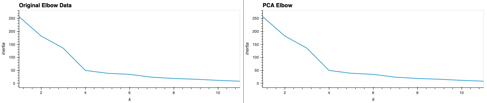
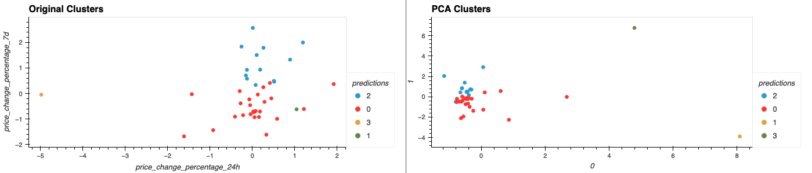

# CryptoClustering

## Overview

In this project, I used unsupervised machine learning techniques in Python to analyze and cluster cryptocurrencies based on their recent performance metrics. Specifically, I investigated whether 24-hour and 7-day price changes impact the grouping of digital assets. I applied K-Means clustering on both the original feature set and a reduced feature set obtained through Principal Component Analysis (PCA), then compared the resulting clusters to evaluate how dimensionality affects clustering performance.

---

## Table of Contents

- [Technologies](#technologies)
- [Usage](#usage)
- [Results & Visualizations](#results--visualizations)
- [Repository Structure](#repository-structure)


---

## Usage

This analysis is completed in a Jupyter Notebook titled `Crypto_Clustering.ipynb`.

---

## Results & Visualizations

### 1. K-Means Clustering with Original Features

After normalizing the data, I applied the elbow method to determine the optimal number of clusters (`k`) for the original features (24-hour and 7-day price changes). The elbow plot below shows the inertia values for `k` values from 1 to 11:



I used the best `k` to cluster the cryptocurrencies and created the following scatter plot using `hvPlot`, with 24h and 7d percentage changes as axes:



### 2. Dimensionality Reduction with PCA

I reduced the data to three principal components using PCA to simplify the feature space and improve cluster visualization. The total explained variance of the three components was noted and included in the analysis.

The elbow method was re-run on the PCA-transformed data to find the optimal `k`, and K-Means clustering was repeated.

### 3. Cluster Comparison and Interpretation

To evaluate the effect of using fewer features, I created composite plots of both the elbow curves and scatter plots, comparing clusters from the original feature set and the PCA-reduced set. These visual comparisons help demonstrate how dimensionality reduction can cleanly separate clusters without significant loss of information.

The PCA-based clustering appeared more compact and visually distinct, showing that fewer features still retained critical variance for meaningful grouping.

---

## Repository Structure

```
CryptoClustering/
│
├── Crypto_Clustering.ipynb        # Main notebook with analysis and visualizations
├── README.md                      # Project documentation
├── .gitignore                     # Git ignore file
│
├── Resources/                     # Folder containing data
│   └── crypto_market_data.csv
│
└── images/                        # Folder containing output plots
    ├── elbow_comparison.png
    └── scatter_comparison.png
```